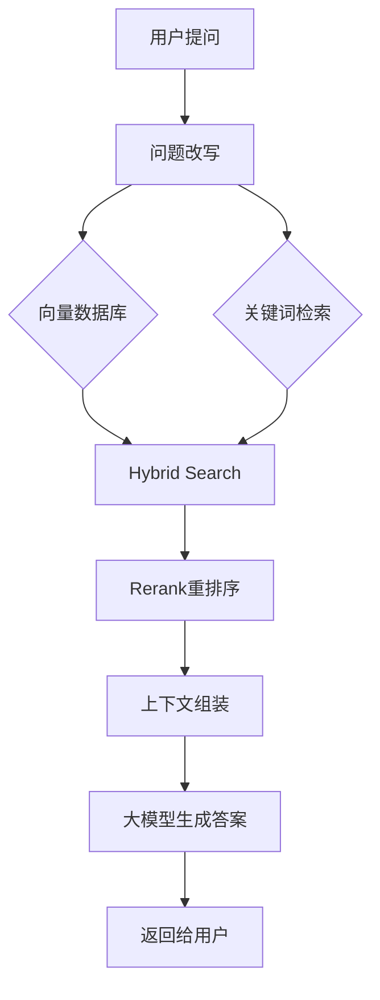
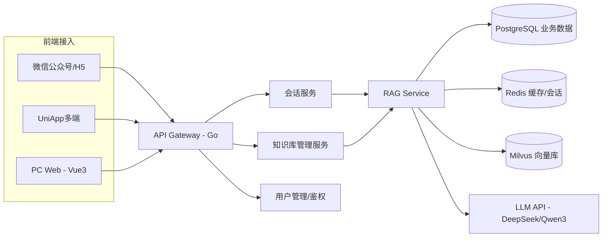

## 为什么传统客服机器人效果那么差

传统客服机器人本质上是在做**文本匹配**，而不是**理解**。这是所有问题的根源。

### 关键词匹配：形似神不似

关键词匹配 + 同义词库的方案，看起来能覆盖常见问题，实际上脆弱得离谱。

用户问「怎么退货」，机器人匹配到「退款流程」的 FAQ。换个说法「我不想要了怎么办」，匹配失败，直接跳人工。同一个意思，措辞稍微变一下就匹配不到。

更糟的是**误匹配**。用户问「这个订单还能退吗」，机器人把「退」匹配到了「退差价」的 FAQ，答非所问。用户骂一句「什么垃圾」，流失了。

关键词匹配本质上就是正则 + 同义词库，没有任何语义理解能力。稍微复杂一点的句子，或者包含多个意图的问题，直接抓瞎。

### FAQ 配置：成本黑洞

传统客服的知识库是靠人工一条条配 FAQ。每条要写标准问题、答案、关键词、扩展问法。

10 条还好，1000 条呢？我们一个电商售后项目，整理了三个月，配置了 2000 多条 FAQ，每天还在加。

而且业务变化快。产品线调整、促销规则变更、物流政策更新——每改一次，FAQ 就得跟着改一轮。维护成本高得离谱，而且永远跟不上业务变化的速度。

### 没有上下文：对话树是死的

多轮对话树的设计思路是「用户按剧本走」。但实际用户根本不按剧本来：

```
用户：我想查一下快递
机器人：请提供订单号
用户：KF20240315001
机器人：您的快递正在配送中，预计明天到达
用户：那个红色的呢？
```

最后一句「那个红色的呢」，正常人类都知道是在问「红色那件商品的快递情况」，但传统机器人理解不了。它没有对话记忆，也不会做指代消解。

结果就是：这种对话只能转人工。准确率常年卡在 60% 左右，客户不满意，项目被砍。

## RAG 是什么

RAG — Retrieval Augmented Generation，翻译过来是**检索增强生成**。

但说人话就是：**让大模型在回答之前，先去查一下你的知识库，然后根据查到的内容来回答。**

它不是训练模型，也不是微调。模型本身的参数和权重没有任何变化。它只是在推理流程中间插了一步——从外部知识库检索相关的内容，然后拼到 prompt 里喂给大模型。

RAG 的工作流程：



这个流程看着简单，但每一步拆开都有很多坑。

## 企业 AI 客服整体架构

先看完整的架构：



### 技术栈选型

| 组件 | 选型 | 为什么 |
|------|------|--------|
| 前端 | Vue3 + UniApp | 一套代码跑多端，省人力 |
| 后端 | Golang | 并发好，Goroutine 处理 SSE 流式输出省心 |
| 业务数据库 | PostgreSQL | 性能稳定，支持 JSON 字段 |
| 缓存 | Redis | 会话管理、热点问题缓存、限流 |
| 向量库 | Milvus | 开源成熟，企业级，支持标量+向量混合检索 |
| 大模型 | DeepSeek + Qwen3 | 国产模型性价比高，支持长上下文 |

选 Golang 的原因很实际。客服系统的核心接口是对话，需要流式输出。Go 的 goroutine + channel 天然适合做 SSE（Server-Sent Events）。如果用 Java 做，还得折腾 WebFlux 或者异步 Servlet，代码复杂度高一截。

选 DeepSeek 和 Qwen3 主要是成本和合规。国外模型在国内企业场景下延迟高、有数据出境的合规风险。DeepSeek 的 API 价格相对低，Qwen3 语义理解能力强，两个互补着用。

## 知识库构建过程


### 文档上传与解析

企业的知识来源五花八门。我们遇到过的：

- 产品说明书（PDF）
- 内部培训文档（Word）
- 运维运维文档（Markdown）
- 官网帮助中心（需要爬虫抓取）

上传之后就按类型分发到不同的解析器：

```go
type Parser interface {
    Parse(reader io.Reader) ([]TextBlock, error)
}

func GetParser(fileType string) Parser {
    switch fileType {
    case "pdf":
        return &PDFParser{}
    case "docx":
        return &WordParser{}
    case "md":
        return &MarkdownParser{}
    case "html":
        return &HTMLParser{}
    default:
        return nil
    }
}
```

PDF 解析是最大的坑。很多 PDF 看着排版漂亮，但底层是图片拼起来的——文字根本提不出来。后来我们对这类 PDF 走了 OCR 通道，用 PaddleOCR 做文字识别，虽然慢一点但至少不漏内容。

### Chunk 切块策略

解析完文档之后，最关键的步骤是切块。说白了就是：把一篇文章切成一段一段的，每一段作为一个独立的知识单元入库。

```go
type ChunkStrategy struct {
    Size    int
    Overlap int
    SplitBy string // paragraph | sentence | fixed
}

func NewDefaultStrategy() ChunkStrategy {
    return ChunkStrategy{
        Size:    500,
        Overlap: 100,
        SplitBy: "paragraph",
    }
}
```

**Chunk Size = 500，Overlap = 100**，这个配置是我们试了十几种组合试出来的。

为什么是 500？太小的 chunk，比如 100~200 个字，语义不完整。比如一段话：

> 退货流程需要用户先提交申请，客服审核通过后，用户将商品寄回，仓库收到后 3 个工作日内退款。

如果 chunk size 太小，可能只切到「客服审核通过后」就断了，后面的退款流程就丢了。召回的时候搜到了这段，但内容是不完整的。

太大也不行，比如 2000 字一段。里面可能讨论了退货、换货、退款三个话题。用户问「换货怎么操作」，向量检索把这整段都召回了，但里面只有一小段是讲换货的，其余都是噪声。大模型看到这么一大段，注意力被分散了，反而答不准。

Overlap = 100 的目的是让相邻 chunk 之间有一部分重叠内容。这样切在边界上的关键信息不会丢失。

### Embedding 向量化

文本切好之后，需要转成向量才能做相似度检索。这个过程叫做 Embedding。

简单理解：一段文本 -> 一个固定长度的数字数组。比如：

```
"如何退货" → [0.12, -0.34, 0.56, ..., 0.89]  // 768维向量
```

两段文本的语义相似度，用余弦距离算一下就行。越相近的文本，向量距离越小。

Embedding 模型的选择：

```python
# BGE-M3 示例
from sentence_transformers import SentenceTransformer

model = SentenceTransformer("BAAI/bge-m3")
embeddings = model.encode(["如何申请退货", "退货流程是怎样的"])
print(embeddings.shape)  # (2, 1024)
```

我们线上用的是 BGE-M3，1024 维，支持 100+ 种语言，中文效果不错。Qwen3-Embedding 我们也试过，在某些垂直领域（如医疗、法律）表现更好，但通用场景下 BGE-M3 性价比更高。

选 Embedding 模型不要光看 MTEB 榜单。企业场景下要实际测你的文档。拿 200 个真实问答做召回测试，看 top-5 命中率。榜单第一名的模型不一定在你业务数据上好用。

## RAG 最核心：知识召回


很多人以为 RAG 就是「把问题转成向量 -> 去向量库搜一下 -> 把结果拼到 prompt 里」。实际做起来远不止这么简单。

### 只做向量检索为什么不够

向量检索本质上是语义检索。它能理解「退货」和「退换货流程」是相关的。但它有一个致命缺点：对精确匹配不敏感。

举个例子，用户问：「订单 KF20240315001 的快递到哪了？」

向量检索会理解「订单」「快递」「在哪」这几个语义，但**它不会在意 KF20240315001 这个具体的订单号**。如果知识库里有 100 条快递相关的 FAQ，向量检索可能会召回「如何查询快递」这种通用 FAQ，而不是跟 KF20240315001 相关的那个具体回答。

关键词检索正好相反。它对语义不敏感，但精确匹配能力强。它能准确找到包含某个订单号或者 SKU 编码的文档。

所以 Hybrid Search 是必须的。

### Hybrid Search 实现

```go
type SearchResult struct {
    ChunkID    string
    Content    string
    VectorScore float64
    KeywordScore float64
    FinalScore  float64
}

func HybridSearch(query string, topK int) []SearchResult {
    // 1. 向量检索
    queryVec := embeddingModel.Encode(query)
    vectorResults := milvus.Search(queryVec, topK*2)
    
    // 2. 关键词检索
    keywordResults := pg.FullTextSearch(query, topK*2)
    
    // 3. 分数融合
    results := mergeAndNormalize(vectorResults, keywordResults)
    
    // RRF 融合算法
    for _, r := range results {
        r.FinalScore = 0.5*r.VectorScore + 0.5*r.KeywordScore
    }
    
    sort.Slice(results, func(i, j int) bool {
        return results[i].FinalScore > results[j].FinalScore
    })
    
    return results[:topK]
}
```

分数融合我们用的是最简单的加权平均。向量分和关键词分各占 0.5。有些场景需要调整权重，比如用户问题里有大量专有名词（订单号、SKU、产品型号），就适当提高关键词权重。

### Rerank 为什么重要

Hybrid Search 召回的结果一般是 20 条。但这 20 条里，可能只有 3~5 条是真正有用的。

Rerank 做的事情是：**用另一个模型把这 20 条重新排序，把最相关的排前面。**

```python
from rerankers import Reranker

reranker = Reranker("BAAI/bge-reranker-v2-m3")
results = reranker.rank(
    query="怎么退货",
    docs=[
        "退货流程需要登录后...",
        "我们的营业时间是...",
        "换货流程与退货不同...",
        "退款将在收到退货后...",
        ...
    ]
)
# 返回排序后的结果，保留 top-5
```

没有 Rerank 会出现什么问题？

知识库里的文档，相似度高的不一定是答案需要的。比如：

- 用户问「怎么退货」
- 向量检索召回了「退货流程」（相关度 0.89）和「换货流程」（相关度 0.82）
- 按照向量距离排，前三条都是跟「退款」「售后」相关的，但最相关的「退货流程」其实排在第二条
- 结果大模型看到两条不太相关的内容，混淆了，给出了错误的回答

加了 Rerank 之后，准确率从 72% 提升到了 91%。这是线上真实数据。

## 多租户知识库设计

SaaS 系统最核心的问题：怎么保证不同客户的知识库数据不串？

### 数据隔离方案

最简单的做法：**按 tenant_id 过滤**。每条知识库记录都带上 tenant_id，查询的时候强制过滤。

```sql
CREATE TABLE knowledge_docs (
    id          BIGSERIAL PRIMARY KEY,
    tenant_id   VARCHAR(64) NOT NULL,
    doc_name    VARCHAR(255) NOT NULL,
    doc_type    VARCHAR(32) NOT NULL, -- pdf, docx, md
    status      INT DEFAULT 0,       -- 0=待处理, 1=已处理
    created_at  TIMESTAMP DEFAULT NOW(),
    updated_at  TIMESTAMP DEFAULT NOW()
);

CREATE INDEX idx_docs_tenant ON knowledge_docs(tenant_id);

CREATE TABLE knowledge_chunks (
    id          BIGSERIAL PRIMARY KEY,
    tenant_id   VARCHAR(64) NOT NULL,
    doc_id      BIGINT REFERENCES knowledge_docs(id),
    chunk_index INT NOT NULL,
    content     TEXT NOT NULL,
    embedding   VECTOR(1024),      -- pgvector
    metadata    JSONB,
    created_at  TIMESTAMP DEFAULT NOW()
);

CREATE INDEX idx_chunks_tenant ON knowledge_chunks(tenant_id);
```

Milvus 那边的处理方式类似。建 Collection 时带上 tenant_id 作为分区键，检索时指定 partition key 过滤。

```go
// Milvus 多租户过滤
searchParams := `{
    "tenant_id": "` + tenantID + `"
}`

results, err := milvusClient.Search(ctx, &milvus.SearchRequest{
    CollectionName: "knowledge_chunks",
    PartitionNames: []string{},
    Data:           []entity.Vector{queryVec},
    SearchParams:   searchParams,
    Filter:         fmt.Sprintf("tenant_id == '%s'", tenantID),
    Limit:          20,
})
```

这里有个注意点：**不要在查询的时候才想起来过滤 tenant_id。**写数据的时候就按 tenant_id 分 collection 或者分 partition，检索时直接从对应的 partition 里搜。否则所有客户的数据混在一起，出隔离问题的风险很大。

### 权限控制

数据隔离之外，还有权限控制。同一个企业内的不同角色能看到的知识库范围是不一样的。

```
租户 A
├── 公共知识库（所有人可见）
├── 售后知识库（售后团队可见）
└── 技术知识库（技术团队可见）
```

实现上就是在知识库文档上加 permission_groups 字段，检索时加上用户角色过滤。

## 项目中遇到的几个坑

做 RAG 客服这大半年，踩过的坑能写一本小册子。挑几个印象深刻的：

### 坑 1：Chunk 切太大，召回全是噪声

刚开始做的时候，我们参考了一些开源项目，把 chunk size 设到了 1500。结果用户问一个简单的问题，召回了 2000 多字的文档片段。大模型看到这么多内容，注意力被稀释了，回答经常跑偏。

**解决：** 缩短到 500~600，配合 overlap。同时也做了 chunk 内标题语义提取——把段落标题也塞进 chunk 里帮助定位。

### 坑 2：Chunk 切太小，上下文断了

有一次用户问「售后退款需要什么材料」。我们知识库里有一条 chunk 是「退款材料清单：1. 订单截图 2. 退款原因说明 3. 商品照片」，但前面的 chunk 被切到了「退款流程第一步：确认收货状态」。两条 chunk 都不完整。

**解决：** 语义切块，按段落切而不是按固定字符切。同时通过 overlap 保证关键上下文不丢失。

### 坑 3：切换 Embedding 模型，全部重建索引

初期用的 text2vec-large-chinese，后来发现效果不如 BGE-M3，决定换。结果发现——不同模型产生的向量空间不一样，没法直接增量迁移。只能全部重新跑一遍 Embedding。

100 万份文档重跑，花了 3 天。中间还因为并发数太高把 GPU 打满了，服务挂了两次。

**解决：** 做好预案。先在小数据集上验证新模型效果，确认提升明显再换。跑任务时控制并发，分批做。现在业内有个趋势是用同一个模型公司出品的 Embedding+Reranker 组合，减少切换概率。

### 坑 4：向量库内存占用爆炸

Milvus 默认配置索引，100 万条 1024 维向量，内存占用直奔 20GB+。客户的服务器配置是 32GB 的，Milvus 一个进程就吃满了，PostgreSQL 和其他服务只能挤在一起。

**解决：**

- 使用 IVF_FLAT 索引替代默认的 HNSW，内存降低 40%
- 降低向量维度？不行，效果会掉。改用了 Mmap 模式，把不常访问的数据映射到磁盘
- 分片存储，按 tenant_id 分 partition

### 坑 5：大模型上下文装不下

召回的结果加上 prompt 模板，有时候能到 15K tokens。早期用的 DeepSeek-V2 上下文只有 32K，一超过就截断，截掉了关键信息。

**解决：** 换了支持 128K 上下文的模型（Qwen3-72B 和 DeepSeek-V3）。同时做了上下文压缩——如果召回结果超过限制，按 Rerank 得分裁剪，只保留分数最高的几条。

## 成本分析

很多人担心 AI 客服成本高不可攀。其实算下来还好。假设 100 家企业客户，知识库总计约 10 万份文档（平均每家企业 1000 份）。

### 基础设施成本（月）

| 组件 | 配置 | 月费用（约） |
|------|------|------------|
| PostgreSQL | 16C 64G 1TB SSD | ¥3000 |
| Redis | 8C 16G | ¥800 |
| Milvus | 8C 32G 200G SSD | ¥2500 |
| 应用服务器 | 8C 16G × 2 台 | ¥2000 |
| **合计** | | **¥8300/月** |

### Embedding 成本（一次性）

10 万份文档，按平均每份切 30 个 chunk，总计约 300 万条。

```
300万条 × 0.0005元/条（BGE-M3本地部署） ≈ ¥1500（一次性）
```

如果用本地 GPU 做，基本只有电费。我们用的是一张 RTX 4090 跑离线任务。

### 模型调用成本（按日估）

```
日均对话量：10万次
每次对话平均 tokens：输入 3000 + 输出 500 = 3500
日均 tokens：10万 × 3500 = 3.5亿

DeepSeek API 价格：输入 ¥0.5/百万tokens，输出 ¥2/百万tokens
日均成本：3.5亿 × 0.0007元/1000tokens（混合价）≈ ¥245/天
月成本：¥7350
```

实际上因为很多简单问题可以用缓存回答，加上 BGE-M3 的本地 reranker，实际月成本大概在 ¥5000~8000 之间。

### 总成本

```
基础设施：¥8300
模型调用：¥5000~¥8000
总计：约 ¥13,000~¥16,000/月

分摊到 100 家企业：每家企业 ¥130~¥160/月
```

对比招一个客服的月薪（¥5000~¥8000），RAG 客服能处理 70% 左右的常见问题，剩下的 30% 转人工。企业其实是省钱了的。

## 总结

做了两年多 RAG 客服项目，交付了十几个客户，我的体会是：**RAG 本身不是什么新技术，但做好的难度被远远低估了。**

真正影响最终效果的因素，按重要性排序：

1. **知识质量** — 垃圾进垃圾出。文档不规范、信息过时，模型再强也救不了
2. **Chunk 策略** — 太大太小都不行，要找到适合你业务的粒度
3. **Hybrid Search** — 纯向量检索不够，必须加关键词兜底
4. **Rerank** — 召回之后的二次筛选，准确率提升 10~20 个百分点
5. **Prompt 设计** — 让模型学会「不知道就说不知道」，而不是瞎编

RAG 不是万能的。它不能解决「知识库里根本没有答案」的问题，也不能代替人工客服做情感安抚和复杂沟通。但它是目前企业知识库和 AI 客服落地最成熟的方案——不魔改模型、不烧 GPU、数据可控、效果可预期。

如果你的团队正准备做 AI 客服，建议从一个小场景开始：选一个产品线，配好知识库，走通全流程，再逐步扩展。一口吃不成胖子，RAG 也一样。
